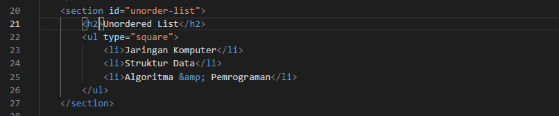

# Lab3Web

## Nama     : Muhammad Romdhon
## NIM      : 312010434
## Kelas    : TI.20.A1
## Matkul   : Pemograman web

## Langkah-langkah praktikum
 Persiapan membuat dokumen HTML dengan nama file lab3_list.html seperti berikut, disini saya menggunakan VSC

## Membuat Order List 
 Kemudian tambahkan kode untuk membuat Ordered List seperti berikut.

## Membuat Unorder List
 Kemudian tambakan kode untuk membuat Unordered List, setelah deklarasi ordered list pada
section unordered-list, seperti berikut.

## Membuat Description List
 Kemudian tambahkan kode untuk membuat description list setelah deklarasi unorderd-list.

## Membuat Tabel
 Buat file baru dengan nama lab3_tabel.html seperti berikut.

 Kemudian selanjutnya tambahkan kode untuk membuat tabel sederhana seperti berikut:

